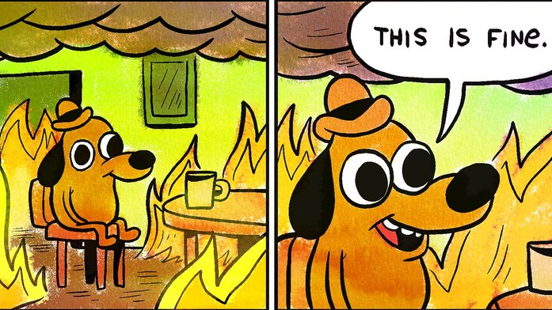

# Setup

```{r}
library(rpart)
library(rpart.plot)
library(knitr)
library(modelr)
library(tidyverse)
train <- read_csv("data/train_clean.csv")
train
```


# Types of models

- For our purposes, we can divide statistical models into two large camps.
- Predictions of:
    1. Continuous variables (linear regression, generalized additive)
    2. Categorical variables (logistic regression, decision trees, random forests) 
- And we have talked briefly about both although we have spent more time on the linear modeling.

## Linear Review

```{r}
data(diamonds)
diamonds <- 
  diamonds %>%
  mutate(lcarat = log(carat), lprice = log(price))
linear_model <- lm(lprice~lcarat, data = diamonds)
summary(linear_model)
```

```{r}
demo <- sample_n(diamonds, 100)
demo <- add_predictions(demo, linear_model)
demo %>% 
  arrange(pred) %>%
  ggplot(aes(x = lcarat, y = lprice)) +
  geom_point() +
  geom_line(aes(y = pred), color = "blue")
```

- Residuals should be normally distributed.
- All else being equal, smaller residuals are a good thing.
- We used our linear model to:
    - Better understand factors which influence a diamonds price (size matters)
    - And we were able to use it to make reasonably useful predictions regarding how much a diamond would cost.
- We don't need to worry about this any more tonight, so we will delete the data.

```{r}
rm(demo, diamonds, linear_model)
```


## Categorical

- To discuss categorical models, I will introduce you to one of my favorite data sets: Titanic.
- This data can be used to understand risk factors and outcomes related to . . . drowning . .. on the night HMS Titanic sank.

```{r}
train %>%
  group_by(survived) %>%
  summarize(n = n()) %>%
  mutate(p = round(n/sum(n)*100,2))
```

- HMS Titanic sunk on 15 April 1912 after bumping not so gently into an iceberg.
- Passenger vessels such as Titanic were largely viewed as unsinkable, and thus did not carry enough lifeboats to save everyone on-board.
- Lifeboats were actually viewed as a tool to aid shuttling passengers from a stricken ship to a rescue vessel and not as a primary means of keeping people out of the ocean.
    - A stricken ship could be one with a mechanical breakdown, etc.
    - This lax attitude towards lifeboats would start to shift because of this and other disasters.
- And I'm sure you have all heard the phrase "women and children first".
    - Tonight we will put this adage to the test.
    - Were women and children more likely to survive?
- And I want you to answer this immediate question.
    - I'm trying to kill all the suspense here.

```{r}
## Were women more likely to survive?

```

```{r}
## Were children more likely to survive?

```

- Good job! (Or not if you just sat there staring at your fingers.)
- And, if you recall, we discussed the connection to logistic regression via the odds ratio.

```{r}
odds <- 
  train %>% 
  group_by(sex) %>%
  summarize(
    survived = sum(survived),
    died = n() - sum(survived),
    total = n()
  ) %>%
  mutate(
    risk_survived = survived/total,
    odds_survived = survived/died
         )
odds
```

So let's talk about these odd `odds_survived`.
    - female: For every woman who died, 2.87 women survived.
    - male: For every man who died, .23 men survived.
    - Being male that night was unhealthy.
    - And we can test this logic out.s
    
```{r}
## Females: For every woman who died (81), 2.88 women lived.
## Since we rounded our odds, we overshoot the number of survived slightly, but you get the idea here.
81 * 2.88
```

- OK, that's grand. And we can use this to calculate the odds ratio between the two groups.
- Which simply reinforces our narrative.

```{r}

odds %>% summarize(
  odds_survived_female = odds_survived[sex == "female"],
  odds_survived_male = odds_survived[sex == "male"],
  odds_survived = odds_survived[sex == "female"]/odds_survived[sex == "male"],
  risk_survived_female = risk_survived[sex == "female"],
  risk_survived_male = risk_survived[sex == "male"],
  risk_survived = risk_survived[sex == "female"]/risk_survived[sex == "male"]
  )
```

- In epidemiology, odds are usually calculated on risk factors which increase the chance of disease.
    - Thus, we are used to seeing a high odds ratio (and this _is_ high) as bad.
    - But in this case, because we are modeling survival, a high odds ratio is protective.
    - Also remember that a high odds ratio over states risk for frequent events.
    - So while the odds are 12x, it is safer to say men were 4x more likely than women to die.
- Of course, this can be done for children, and any other combination of factors as you like.
- But perhaps there is some other way to think about this.


## VERY SIMPLE MODEL: Everyone survives.

- We have 891 rows in `train`.
- If we just "predict" EVERYONE on Titanic survives, how accurate would this model be?
- 341 people _did_ survive, and we would have gotten ALL of those answers right.
- Our other 549 guesses are all wrong.
- Introducing the confusion matrix!
    - https://en.wikipedia.org/wiki/Confusion_matrix

|              | Predicted Survived   | Predicted Not Survived  |
|:------------:|:--------------------:|:-----------------------:|
| Not Survived | FALSE POSITIVE (549) | TRUE NEGATIVE (0)       |
|     Survived | TRUE POSITIVE (342)  | FALSE NEGATIVE (0)      | 


- Our FALSE POSITIVES outnumber our TRUE POSITIVES.
    - That is rarely OK. 
- And our accuracy is just 342/891, which stinks.
- A model based on flipping a coin would have been MORE accurate.
    - Heads you live.
    - Tails you die.


## Simple model: All Women Survive

- We know women are more likely to survive than men.
    - Model the assumption that ALL women live and ALL men die.
    - It is brutal, but because the odds of a woman surviving are 12x that of men, it actually kinda works.
- This one, we won't do as a thought experiment. We'll write it out.

```{r}
## First, we make our prediction.
train <- 
  train %>%
  mutate(pred_survived = case_when(sex == "female"~1, TRUE~0))

## And then we assess it.
confusion <- 
  train %>%
  group_by(survived) %>%
  summarise(pred_survived = sum(pred_survived),
            pred_not_survived = n() - sum(pred_survived)
            )
confusion
```

|              | Predicted Survived   | Predicted Not Survived  |
|:------------:|:--------------------:|:-----------------------:|
| Not Survived | FALSE POSITIVE (81)  | TRUE NEGATIVE (468)     |
|     Survived | TRUE POSITIVE (233)  | FALSE NEGATIVE (109)    | 

Accuracy = TRUE POSITIVES + TRUE NEGATIVES / TOTAL
78.68 = (233 + 468) / 891 * 100

- A model that is nearly 80% accurate is actually pretty good.
- How to calculate accuracy using R.

```{r}
accuracy <-
  confusion %>% 
  summarize(
    ## This is just the total of right answers divided by the total number of rows.
    (pred_survived[survived == 1] + pred_not_survived[survived == 0]) / nrow(train)
  )
accuracy * 100
```

- More Accuracy is generally good.
- Models have to balance Type I and II error.
    - FALSE POSITIVE == Type  I Error
    - FALSE NEGATIVE == Type II Error
- And the right balancing point is ultimately subjective, or due to factors outside of the model itself.


# Get On The CART

- Classification and Regression Trees AKA CART models are a way of building models that is unlike anything you've probably ever seen before.
- I could ramble on about what it is, but I think it helps to see one.

```{r}
## Categorical data must be a factor, string, or logical.
## We need to remove our prior predictions. We don't need that in our CART model.
train <- 
  train %>%
  mutate(
    survived = as.factor(survived),
    pclass = as.factor(pclass),
    child = as.logical(child)
  ) %>%
  select(-pred_survived)

cart_model <- rpart(survived~sex, data = train, method = "class")
summary(cart_model)
rpart.plot(cart_model)
```

- .38 tells us that over-all, only 38% of the population survives.
- The 1 or 0 tells us if the model would bin that group as survived or died.
- sex = male
    - The .19 in blue tells us that only 19% of men survive.
    - The 65% tells us this branch of the tree contains 65% of the passengers.
- sex = female
    - The .74 in light green tells us 74% of women survive.
    - The 35% tells us this branch of the tree contains 35% of the passengers.
    - But our model would predict they would live.
- Let's add another branch to our tree!
- Internally, it is doing something SIMILAR to looking for the biggest odds ratio.
- But it is instead looking at what is called the gini purity.
    - What two-way split can we make with our data to maximize the "purity" of our two leaves.
    - In other words, what split lumps:
        - The most surviving passengers with other surviving passengers.
        - The most deceased passengers with other deceased passengers.
        - We are not going to worry about the math.
        - I think it will be clear as we move along.

Let's add age to our model and see what happens.

```{r}
cart_model <- rpart(survived~sex+age, data = train, method = "class")
summary(cart_model)
rpart.plot(cart_model)
```

- So, even though it has age, it still thinks gender makes the groups purer than age can.
    - In other words, there is now split using age that better separates survived and deceased than gender.
    - There is not statistical test here. If there's a single extra case, that wins.
    - As the groups become smaller, this becomes a problem.
- The model decided age isn't useful for women.
- But identifying children under the age of 6.5 makes it possible to increase the accuracy of the model, for 3% of the total population.
- We also know First and Second class passengers had first dibs on the boats.

```{r}
cart_model <- rpart(survived~sex+pclass+age, data = train, method = "class")
summary(cart_model)
printcp(cart_model)
rpart.plot(cart_model)
```

- WOW
- The model can "see" in the data how first and second class MEN did not get onto the lifeboats.
- Across the bottom, you want to be in one of the greed groups. Not the blue. Blue is bad.

```{r}
train <- train %>% add_predictions(cart_model, type = "class") 

train <-
  train %>%
  mutate(
    pred_survived = as.numeric(levels(pred))[pred],
    pred_not_survived = 1-as.numeric(levels(pred))[pred]
  )
train

## And then we assess it.
confusion <- 
  train %>%
  group_by(survived) %>%
  summarise(pred_survived = sum(pred_survived, na.rm = TRUE),
            pred_not_survived = n() - sum(pred_survived, na.rm = TRUE)
            )
confusion
```

And we can look at the accuracy:

```{r}
accuracy <-
  confusion %>% 
  summarize(
    ## This is just the total of right answers divided by the total number of rows.
    (pred_survived[survived == 1] + pred_not_survived[survived == 0]) / nrow(train)
  )
accuracy * 100
```

- So yes, this is a lot more work, but we are more accurate now than we were.

## SOME GOOD/SOME BAD

- AWESOME SAUCE
   - Decision trees are awesome.
   - They provide a strong visual reference.
   - They can be surprisingly accurate/complex.
- UH OH!!!!
    - They are prone to over-fitting.
    - This is where we are modeling on quirks in the data AND not indicative of a larger trend.
    
DON'T OVER FIT!!!

- It is possible to tell the rpart command what the smallest group size can be.
    - minsplit:	the minimum number of observations that must exist in a node in order for a split to be attempted.
    - minbucket: the minimum number of observations in any terminal <leaf> node.
- You can set a maxdepth, to control how deep your tree grows.
- And you can do a random forest, but that is a topic for next week.